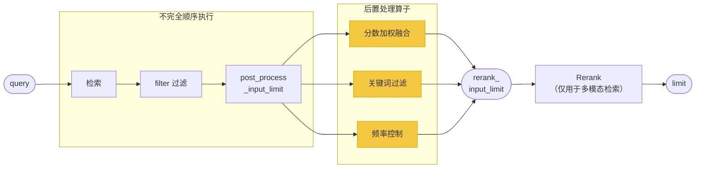

**当前检索能力在检索范式中的定位：**



检索后处理算子 是 VikingDB 提供的一种**检索后处理能力（PostProcess）**，用于在检索**召回和标量过滤**之后，对候选数据进行进一步的过滤和优化，确保最终返回的搜索结果更加精准、高效。
在 VikingDB 中，后置处理算子可用于：

* **标量权重融合：​**基于业务需求结合数据时间/空间的信息进行融合排序，融合多个自定义的业务指标得分，从而生成一个更贴合业务需求的最终排序分数，确保召回排序结果符合业务预期。
* **结果精准筛选**：基于业务需求通过正则匹配设定筛选规则，如筛选包含某种特征文字信息的商品，确保用户获得有效的检索结果。
* **数据质量提升**：使用正则匹配对检索结果进行格式校验，过滤包含特殊字符、非法内容或广告信息的数据，确保返回内容符合标准，提高数据规范性。
* **检索结果均衡**：对特定字段设置出现频率限制，防止某些值占据过多搜索结果，如热门品牌、热门作者或特定分类过度曝光，保证检索结果的多样性和公平性。

:::tip
**后置处理算子是检索公共参数，您可以将其应用在向量检索、多模态检索等能力中。**
:::

<span id="5a4e9762"></span>
# **请求参数**
在向量检索请求的基础上，您可以在 search 请求参数中指定 **`post_process_ops`、`post_process_input_limit`**` `子参数设定后置处理算子，具体可参考[检索公共参数](/docs/84313/1791133)。

|算子 |适用字段类型 |介绍 |示例 |
|---|---|---|---|
|score_fusion |string |分数融合算子，用于融合指定的时空标量的分数。 |\|
| | |> score_fusion与 ES 的 function score query 能力差异比较，参考：[检索参数常见问题](/docs/84313/2179004) |```Scala |
| | | |{ |
| | | |        "op": "score_fusion", |
| | | |        "fusion_by": "add", |
| | | |        "addition_score_weight": 0.6,  //附加score的权重为0.6   ann score的权重为1-0.6=0.4 |
| | | |        "addition_score": [ |
| | | |            { |
| | | |                "factor": 1.0, |
| | | |                "base_value_from": "scalar_field", |
| | | |                "field": "f_sales" |
| | | |            }, |
| | | |            { |
| | | |                "factor": -10.0, // 投诉多的商品，score应该降低 |
| | | |                "base_value_from": "scalar_field", |
| | | |                "field": "f_complain" |
| | | |            } |
| | | |        ] |
| | | |} |
| | | |``` |
| | | | |
| | | | |
|string_contain |\|||
| |string |\||
| | |关键词匹配过滤算子。表示该字段内容包含pattern。 |```JSON |
| | | |{ |
| | | |   "op": "string_contain", |
| | | |   "field": "name", |
| | | |   "pattern": "bar" |
| | | |} |
| | | |``` |
| | | | |
| | | | |
| | | | |
|string_match |\|||
| |string |正则匹配过滤算子。 |\|
| | | |```JSON |
| | | |{ |
| | | |   "op": "string_match", |
| | | |   "field": "name", |
| | | |   "pattern": "^[0-9A-Za-z_]+$" |
| | | |} |
| | | |``` |
| | | | |
| | | | |
|enum_freq_limiter |string |频控算子。用于保证一次召回的结果中, 一个特定取值出现的总数不超过 `threshold` 次。 |```JSON |
| | | |{ |
| | | |  "op": "enum_freq_limiter", |
| | | |  "field": "city" |
| | | |  "threshold": 5 |
| | | |} |
| | | |``` |
| | | | |

<span id="36c7adf0"></span>
# **分数融合算子介绍**
分数加权融合（Score Fusion）是一项强大的检索后处理能力，允许在向量检索（ANN）分数的基础上，融合多个自定义的业务指标得分，从而生成一个更贴合业务需求的最终排序分数，search结果最终的排序和分数都是以此来计算。该功能通过一个灵活的加权公式，将向量相似性与业务逻辑紧密结合。
<span id="808443a7"></span>
## 核心公式
最终分数的计算遵循以下核心公式：
`final_score = origin_score * (1 - weight) + addition_score * weight`

* **origin_score**: 原始的向量检索（ANN）分数。
* **addition_score**: 额外加分项，由一组自定义的业务指标得分加总而成，允许注入如时效性、热度、权威性、用户评分等多维度的业务逻辑。
* **weight**: 用于调节 addition_score 影响力的权重，其取值范围在 `(0, 1)` 之间。默认值0.5
* 另外需注意，默认会打开归一化函数，将 `origin_score` 和`addition_score`缩放到 `(0,1)` 区间内。当需要将不同分布的原始分数与业务分数进行融合时，建议开启此功能以获得更稳定和可预期的结果。归一化后的score计算公式如下：

`final_score = normed1(origin_score) * (1 - weight) + normed2(addition_score) * weight`
<span id="010285a4"></span>
## addition_score的计算方式
`addition_score` 是一个累加值，由一个或多个 `addition_item_score` 相加得出：
`addition_score = Σ (addition_item_score)`
每个 `addition_item_score` 代表一个独立的业务加分项，其计算方式为：
`addition_item_score = factor * base_value`

* **factor**: 因数，用于缩放或反转 `base_value` 的影响。可以将其设置为正数以实现加分，或设置为负数以实现降权或惩罚。默认为1.
* **base_value**: 基础分，是业务指标的原始数值。它的来源有两种方式：
   1. **直接取值 (`scalar_field`)**: 直接使用文档中标量字段的数值作为 `base_value`。适用于如“点赞数”、“销量”等可以直接量化业务价值的场景。
   1. **衰减函数 (`decay_func`)**: 根据标量字段的数值，通过衰减函数（高斯、指数、线性）计算出一个 `(0,1)` 区间内的 `base_value`。适用于如“发布时间”这种与某个“中心点”的接近程度相关的场景。

通过以上分层设计，分数加权融合功能提供了一个高度灵活且强大的工具，用以优化检索结果的排序，使其不仅相关，而且更具业务价值。

<span id="6a09b579"></span>
## score_fusion参数配置

| | | | | | | | \
|参数名 |类型 |必选 |子参数 |类型 |必选 |备注 |
|---|---|---|---|---|---|---|
| | | | | | | | \
|op |string |是 | | | |填`score_fusion` |
| | | | | | | | \
|fusion_by |string |是 | | | |填`add`或`multiply`。表示将原始分数origin_score(向量检索分数，或关键词检索分数)与自定义的附加分数(addition_score)融合的算法。 |\
| | | | | | | |\
| | | | | | |* `add`：最终`score = (1-addition_score_weight) * origin_score + addition_score_weight * addition_score` |\
| | | | | | |* `multiply`：最终`score = origin_score * addition_score` |
| | | | | | | | \
|addition_score_weight |float |否 | | | |用于调节 addition_score 影响力的权重，取值范围(0,1)，开区间，默认值 0.5。当fusion_by为`add`时生效。 |\
| | | | | | |> 如何选择合适的 addtion_score_weight ？参考：[检索参数常见问题](/docs/84313/2179004) |
| | | | | | | | \
|addition_score |list<map> |是 | | | |额外加分项，由一组自定义的业务指标得分加总而成，允许注入如时效性、热度、权威性、用户评分等多维度的业务逻辑。 |\
| | | | | | |自定义的addition_score内容。最终addition_score值由各个addition_item的取值累加得到。 |
|^^|^^|^^| | | | | \
| | | |factor |float |否 |系数。不填则默认为1。不得取0，绝对值不超过1000000 |\
| | | | | | |> factor 参数如何取值 ？参考：[检索参数常见问题](/docs/84313/2179004) |
|^^|^^|^^| | | | | \
| | | |base_value_from |\
| | | | |string |是 |填`scalar_field`或`decay_func` |\
| | | | | | | |\
| | | | | | |* `scalar_field`：直接从标量字段取值。支持数据集中float32或int64类型的标量字段。 |\
| | | | | | |* `decay_func`：用标量字段计算其衰减函数。支持数据集中float32或int64或date_time或geo_point类型的标量字段。 |\
| | | | | | | |\
| | | | | | |> base_value_from 如何取值 ？参考：[检索参数常见问题](/docs/84313/2179004) |
|^^|^^|^^| | | | | \
| | | |field |string |是 |取值字段。支持的字段类型见`base_value_from`的描述。 |
|^^|^^|^^| | | | | \
| | | |func |\
| | | | |string |`base_value_from`为`decay_func`时填写，必填 |衰减函数的类型。当`base_value_from`填`decay_func`才生效。 |\
| | | | | | | |\
| | | | | | |* `linear`：线性衰减函数 |\
| | | | | | |* `exp`：指数衰减函数 |\
| | | | | | |* `gauss`：高斯衰减函数 |
|^^|^^|^^| | | | | \
| | | |scale |\
| | | | |any |\
| | | | | |`base_value_from`为`decay_func`时填写，必填 |刻画衰减函数的衰减幅度。表示当输入参数取值为scale时，衰减函数结果为0.5。当`base_value_from`填`decay_func`才生效。时间、地理相关的输入格式参考[创建数据集Date&Geo](https://www.volcengine.com/docs/84313/1791154?lang=zh#fieldtype) |\
| | | | | | | |\
| | | | | | |* 当field是float32或int64类型字段，则origin填写float。 |\
| | | | | | |* 当field是date_time类型字段，则origin填写时间段格式。 |\
| | | | | | |* 当field是geo_point类型字段，则origin地理距离格式。 |
|^^|^^|^^| | | | | \
| | | |origin |any |`base_value_from`为`decay_func`时填写，非必填 |衰减函数的基准值。当`base_value_from`填`decay_func`才生效。 |\
| | | | | | | |\
| | | | | | |* 当field是float32或int64类型字段，则origin填写float，或不填则默认为0 |\
| | | | | | |* 当field是date_time类型字段，则origin填写date_time格式，或不填则默认为当前检索的实时时间。 |\
| | | | | | |* 当field是geo_point类型字段，则origin必填且为geo_point格式。 |\
| | | | | | | |\
| | | | | | | |
|^^|^^|^^| | | | | \
| | | |offset |\
| | | | |any |`base_value_from`为`decay_func`时填写，非必填 |衰减函数的容忍距离。当`base_value_from`填`decay_func`才生效。 |\
| | | | | | | |\
| | | | | | |* 当field是float32或int64类型字段，则offset填写float，或不填则默认为0 |\
| | | | | | |* 当field是date_time类型字段，则offset填写时间段格式，或不填则默认为0。 |\
| | | | | | |* 当field是geo_point类型字段，则offset填写地理距离格式，或不填则默认为0。 |
|^^|^^|^^| | | | | \
| | | |decay |float |否 |取值(0,1)，开区间。与scale配合使用。默认0.5。 |
| | | | | | | | \
|normalize_for_origin_score |\
| |Normalize（参数结构见下） |否 | | | |对origin_score的归一化配置。若不填，则默认使用`arctan`进行归一化，且arctan_factor=1，arctan_offset=0 |\
| | | | | | |> 是否需要开启归一化，开启有何好处？参考：[检索参数常见问题](/docs/84313/2179004) |
| | | | | | | | \
|normalize_for_addition_score |\
| |Normalize（参数结构见下） |否 | | | |对addition_score的归一化配置。若不填，则默认使用`arctan`进行归一化，且arctan_factor=1，arctan_offset=0 |\
| | | | | | |> 是否需要开启归一化，开启有何好处？参考：[检索参数常见问题](/docs/84313/2179004) |


* **Normalize参数结构**


| | | | | \
|参数名 |类型 |必选 |备注 |
|---|---|---|---|
| | | | | \
|enable |bool |是 |是否进行归一化。默认为true。 |\
| | | |若为false，则不进行归一化，以下参数不生效。 |
| | | | | \
|func |string |否 |归一化函数。若enable=true，则该参数生效，取值`min_max`或`arctan`，默认`arctan`。 |\
| | | | |\
| | | |* `min_max`：result = (x - min_value) / (max_value - min_value) |\
| | | |* `arctan`：result = (arctan(arctan_factor * (x - arctan_offset)) / π) + 0.5 |
| | | | | \
|arctan_factor |float |否 |默认1。当归一化函数选`arctan`才生效。不得取0，绝对值不超过1000000 |
| | | | | \
|arctan_offset |float |否 |默认0。当归一化函数选`arctan`才生效。 |


<span id="de78bf3c"></span>
## 什么是衰减函数？
主要有3种：*线性衰减函数、指数衰减函数、高斯衰减函数*，但它们的**入参**和**输出**形式是完全一致的。
<span id="ad0befb3"></span>
#### **输入参数**

| | | | | | \
|参数名 |类型 |取值范围 |必选 |含义 |
|---|---|---|---|---|
| | | | | | \
|distance |float |(-∞,﹢∞) | |标量字段值。例如，某条数据的时间戳字段值是1750671188。 |
| | | | | | \
|origin |float |(-∞,﹢∞) |\
| | | | |原点。作为参照的基准。计算函数时，实际的距离是abs(distance - origin)。例如，以检索时的时间为基准，可以设为time.now().timestamp() |
| | | | | | \
|scale |float |(0, ﹢∞) | |尺度。定义从原点+偏移的距离，在该距离处计算的分数将等于decay参数。scale越大，衰减地越慢。 |
| | | | | | \
|decay |float |(0,1) |\
| | | |否 |衰减参数。定义了如何按比例给定的距离对文档进行评分。当实际距离值为scale时，衰减函数的值刚好为decay。decay越靠近1，衰减地越慢。默认0.5. |
| | | | | | \
|offset |float |[0,﹢∞) |否 |偏移量。衰减函数将仅计算距离大于定义偏移的文档的衰减函数。默认值为0。 |

<span id="7bf2520f"></span>
#### 衰减特性

<span id="4e995bb5"></span>
#### 计算公式介绍
```Python
import numpy as np

def gaussian_decay(origin, scale, decay, offset, distance):
    """高斯衰减函数"""
    adjusted_dist = max(0, abs(distance - origin) - offset)
    sigma_square = (scale ** 2) / (-2*np.log(decay))
    exponent = -(adjusted_dist ** 2) / (2 * sigma_square)
    return np.exp(exponent)


def exp_decay(origin, scale, decay, offset, distance):
    """指数衰减函数"""
    adjusted_dist = max(0, abs(distance - origin) - offset)
    lambda_val = np.log(decay) / scale
    return np.exp(lambda_val * adjusted_dist)


def linear_decay(origin, scale, decay, offset, distance):
    """线性衰减函数"""
    adjusted_dist = max(0, abs(distance - origin) - offset)
    slope = (1 - decay) / scale
    return max(0, 1 - slope * adjusted_dist)

# 地理距离衰减函数：
# 与上述基本相同，abs(distance - origin)部分，变为 地理坐标点到中心坐标点的距离。
```


<span id="935a48a3"></span>
# 分数融合请求示例
<span id="2360388d"></span>
## **示例1：按销售/投诉数量进行融合**
假设数据集是商品，有“销量”字段`f_sales`（int64类型）、“投诉”字段`f_complain`（int64类型）
场景：我希望召回时，销量数越多的越优先召回，投诉量越少的越优先召回。
**销量配置：​**以标量大小线性排序即可，因此 base_value_from 设置为 scalar_field；
**投诉配置：​**以标量大小线性排序即可，因此 base_value_from 设置为 scalar_field，同时因是负相关，因此factor应该设计为负数；
对应的检索设置如下：
```JSON
"post_process_ops": {
    [
        "op": "score_fusion",
        "fusion_by": "add",
        "addition_score_weight": 0.6,  //附加score的权重为0.6   ann score的权重为1-0.6=0.4
        "addition_score": [
            {
                "factor": 1.0,
                "base_value_from": "scalar_field",
                "field": "f_sales"
            },
            {
                "factor": -10.0, // 投诉多的商品，score应该降低
                "base_value_from": "scalar_field",
                "field": "f_complain"
            }
        ]
    ]
}

```

**例如，​**有一条数据，f_sales=100，f_complain=2，假设ANN score是0.111。
现在设置addition_score_weight=0.6

计算执行如下：
origion_score = 0.111，假设归一化后为0.7
addition_score = (1.0 * 100) + (-10.0 * 2) = 80，假设归一化后为0.8
则总得分是 score = (0.7 * 0.4) + (0.8 * 0.6) = 0.76
<span id="eed034c4"></span>
## **示例2：按发布时间/点赞数进行融合**
**场景：​**假设数据集是短视频，有“点赞数”字段`f_like`（int64类型）、“作品发布时间”字段`f_publish_date_time`（date_time类型），场景希望召回时，点赞数越多的越优先召回，作品发布时间距离当前时间越近的越优先召回。
**点赞数的权重配置：​**以标量大小线性排序即可，因此 base_value_from 设置为 scalar_field；
**发布时间的权重配置：​**会有业务逻辑设计，因此 **** base_value_from 设置为 decay_func；认为距离当前时间24小时以内的，都希望视为最新数据，因此时间因素视为相同；离当前10天的权重可以衰减为一半，因此scale设置为9d、decay设置为 0.5 ；
对应的检索设置如下：
```JSON
"post_process_ops": {
    [
        "op": "score_fusion",
        "fusion_by": "add",
        "addition_score_weight": 0.6,
        "addition_score": [
            {
                "factor": 1.0,
                "base_value_from": "scalar_field",
                "field": "f_like"
            },
            {
                "factor": 2.0,
                "base_value_from": "decay_func",
                "field": "f_publish_date_time",
                "func": "gauss",       // 高斯衰减函数
                "origin": "2025-10-01T00:00:00+08:00",  // 基准时间。
                "offset": "1d",       // 1天。距离当前时间1天以内的，时间因素视为相同。
                "scale": "9d",     // scale和decay参数共同刻画了衰减函数的坡度。这里表示：当时间距离为10天时，衰减函数取值为0.5。
                "decay": 0.5,          
            }
        ]
    ]
}
```

例如，有一条数据，f_like=100，f_publish_date_time="2025-10-22T11:23:48+08:00"(当时的时间)，假设ANN score是0.111
现在设置addition_score_weight=0.6
计算执行如下：
origion_score = 0.111，假设归一化后为0.7
addition_score = (1.0 * 100) + gauss_decay()，假设归一化后为0.8
则总得分是 score = (0.7 * 0.4) + (0.8 * 0.6) = 0.76
